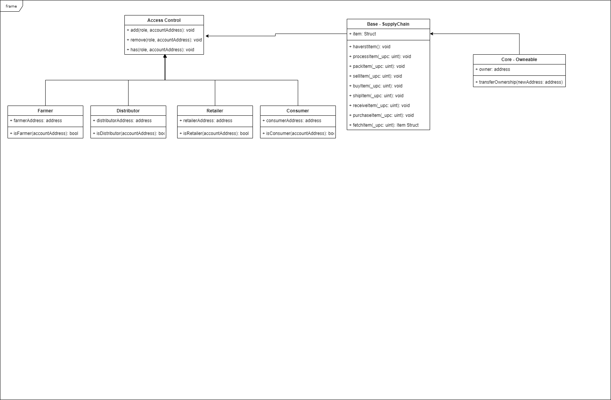

"# coffee-supply-chain-project"

## Write Up

### Project write-up - UML

#### Activity Diagram


#### Sequence Diagram


#### State Diagram


#### Class Diagram


### Requirements & Versions

```
Truffle v5.1.14-nodeLTS.0 (core: 5.1.13)

Solidity - 0.4.24 (solc-js)

Node v10.0.0

Web3.js v1.2.1
```

### Contract Address

```0xFe0df793060c49Edca5AC9C104dD8e3375349978```

### Project write-up - Libraries

I used the library provided on the boilerplate code and complete it by adding other funtionalities. This is used as the AccessControl for my Dapp. It has the following roles: Farmer, Distributor, Retailer, Consumer.

### Project write-up - IPFS

I didn't use IPPS to host my project because I was already able to test this on the lessons challenges and I want to move on.

### General write up

# Supply chain & data auditing

This repository containts an Ethereum DApp that demonstrates a Supply Chain flow between a Seller and Buyer. The user story is similar to any commonly used supply chain process. A Seller can add items to the inventory system stored in the blockchain. A Buyer can purchase such items from the inventory system. Additionally a Seller can mark an item as Shipped, and similarly a Buyer can mark an item as Received.

The DApp User Interface when running should look like...


## Getting Started

These instructions will get you a copy of the project up and running on your local machine for development and testing purposes. See deployment for notes on how to deploy the project on a live system.

### Prerequisites

Please make sure you've already installed ganache-cli, Truffle and enabled MetaMask extension in your browser.

```
Give examples (to be clarified)
```

### Installing

A step by step series of examples that tell you have to get a development env running

Clone this repository:

```
git clone https://github.com/maxmedina05/coffee-supply-chain-project
```

Change directory to ```coffee-supply-chain-project``` folder and install all requisite npm packages (as listed in ```package.json```):

```
=
npm install
```

Launch Ganache:

```
ganache-cli -m "spirit supply whale amount human item harsh scare congress discover talent hamster"
```

Your terminal should look something like this:


In a separate terminal window, Compile smart contracts:

```
truffle compile
```

Your terminal should look something like this:


This will create the smart contract artifacts in folder ```build\contracts```.

Migrate smart contracts to the locally running blockchain, ganache-cli:

```
truffle migrate --reset
```

Your terminal should look something like this:


Test smart contracts:

```
truffle test
```

All 10 tests should pass.


In a separate terminal window, launch the DApp:

```
npm run dev
```

## Built With

* [Ethereum](https://www.ethereum.org/) - Ethereum is a decentralized platform that runs smart contracts
* [IPFS](https://ipfs.io/) - IPFS is the Distributed Web | A peer-to-peer hypermedia protocol
to make the web faster, safer, and more open.
* [Truffle Framework](http://truffleframework.com/) - Truffle is the most popular development framework for Ethereum with a mission to make your life a whole lot easier.


## Authors

* Max
* See also the list of [contributors](https://github.com/udacity/nd1309-Project-6b-Example-Template) who participated in this project.

## Acknowledgments

* Solidity
* Ganache-cli
* Truffle
* IPFS